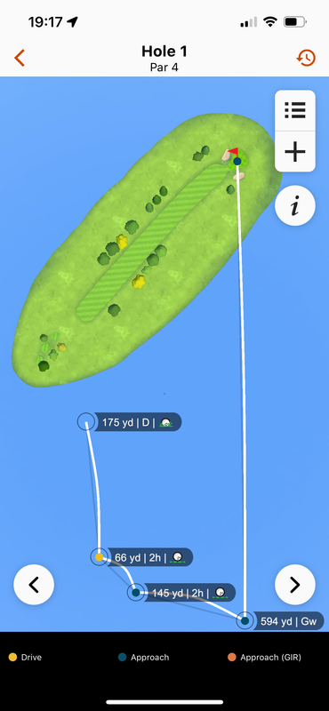

# Garmin Golf Shot Analyzer - Chrome Extension

A Chrome extension that helps golfers identify and fix incorrectly tracked shots in Garmin Connect. This tool scans your golf scorecards to find suspicious shots that are likely GPS errors or tracking bugs, such as putts recorded at 60+ meters, wedge shots at unrealistic distances and other clubs with way too long distances.

Made because finding these shots in the Garmin app or on the web is a hassle. Instead of checking every scorecard manually, this script will do it for you. 

## Problem It Solves

Garmin golf watches sometimes record incorrect shot distances due to:
- GPS signal issues
- Accidental button presses
- Auto-shot detection errors
- Syncing problems

These errors affect your club statistics, and if using one of the Approach watches, the virtual caddy will use these statistics to suggest clubs. This extension helps you quickly find and review these problematic shots so you can correct them in Garmin Connect.



*Example: A Gap Wedge shot incorrectly recorded at 594 yards - exactly the kind of error this extension helps you find and fix.*

## Features

- 🔍 **Automatic Shot Analysis** - Scans all your golf scorecards to find suspicious shots
- ⚙️ **Customizable Club Ranges** - Set your own maximum distances for each club
- 🎯 **Direct Links** - Click to jump directly to problematic shots in Garmin Connect
- 📊 **Smart Detection** - Uses both default and personalized thresholds
- 🔄 **Background Scanning** - Continue browsing while the extension analyzes your data

## Installation

### From Source (Developer Mode)

1. Clone or download this repository:
   ```bash
   git clone https://github.com/loekensgard/garmin-club-fix.git
   ```

2. Open Chrome and navigate to `chrome://extensions/`

3. Enable "Developer mode" in the top right corner

4. Click "Load unpacked" and select the `garmin-club-fix/src` folder

5. The extension icon will appear in your Chrome toolbar

## Setup & Configuration

### 1. Get Your Bearer Token

1. Open [Garmin Connect](https://connect.garmin.com) and log in
2. Open Chrome DevTools (F12 or right-click → Inspect)
3. Go to the Network tab
4. Navigate to your golf scorecards in Garmin Connect
5. Look for any API request (e.g., `/scorecard/summary`)
6. Click on it and find the `Authorization` header
7. Copy the bearer token (starts with `Bearer eyJ...`)

### 2. Find Your User ID

1. While viewing your golf data in Garmin Connect, check the URL
2. Look for a UUID like `12345678-abcd-1234-5678-123456789abc`
3. This is your user ID - copy it

### 3. Configure the Extension

1. Click the extension icon in Chrome toolbar
2. Paste your bearer token in the first field
3. Paste your user ID in the second field
4. Click "Save Settings"

## Usage

### Finding Suspicious Shots

1. Navigate to [connect.garmin.com](https://connect.garmin.com)
2. Click the extension icon
3. Click "Scan for Bad Shots"
4. Wait for the scan to complete (progress bar shows status)
5. Review the suspicious shots grouped by scorecard
6. Click any shot link to open it in Garmin Connect for correction

### Customizing Club Ranges

1. Click "Fetch My Clubs" to load your golf clubs
2. Review your average and max distances
3. Adjust the "Max Distance" for each club based on your abilities
4. Click "Save Club Settings"
5. Future scans will use your custom ranges

### Default Detection Rules

The extension uses these default maximum distances (in meters):

| Club Type | Max Distance | Common Issues |
|-----------|-------------|---------------|
| Driver | 350m | GPS glitches on tee shots |
| 3 Wood | 280m | Auto-detection errors |
| Irons (5-9) | 200-170m | Wrong club selected |
| Wedges (PW/SW/LW) | 150-120m | Chip shots marked as full swings |
| **Putter** | **20m** | **Most common error - GPS jumps** |

## Common Scenarios

### Putter Showing 60+ Meters
**Most common issue!** This happens when:
- GPS signal is lost in woods/buildings
- Watch auto-detects a practice swing as real shot
- You forget to mark the shot and GPS jumps to next tee

### Wedge Showing 180+ Meters
Usually occurs when:
- Wrong club is selected on watch
- Shot detection triggers during cart ride
- GPS correction happens mid-round

## Troubleshooting

### "Please login to connect.garmin.com first"
- Make sure you're logged into Garmin Connect in the same browser
- Try refreshing the Garmin Connect page

### Bearer Token Expired (401/403 errors)
- Tokens expire after 24-48 hours
- Get a new token from DevTools and update in extension

### No Suspicious Shots Found
- Your shots might be within normal ranges
- Try adjusting club ranges if you have unusual distances
- Check if you have any scorecards in your account

### Extension Not Working
1. Ensure you're on connect.garmin.com
2. Check that bearer token is saved
3. Try reloading the extension
4. Check Chrome console for errors (F12 → Console tab)

## Privacy & Security

- **Local Storage Only** - All data is stored locally in your browser
- **No External Servers** - Direct communication with Garmin Connect only
- **Token Security** - Bearer token never leaves your browser
- **Open Source** - Review the code yourself for transparency

## Contributing

Contributions are welcome! Feel free to:
- Report bugs via GitHub issues
- Submit pull requests with improvements
- Suggest new detection algorithms

## Technical Details

Built with:
- Chrome Extension Manifest V3
- Vanilla JavaScript (no frameworks)
- Garmin Connect private API
- Chrome Storage API for persistence

## Disclaimer

This is an unofficial tool not affiliated with Garmin. Use at your own risk. Always verify suggested corrections before making changes to your scorecards.
